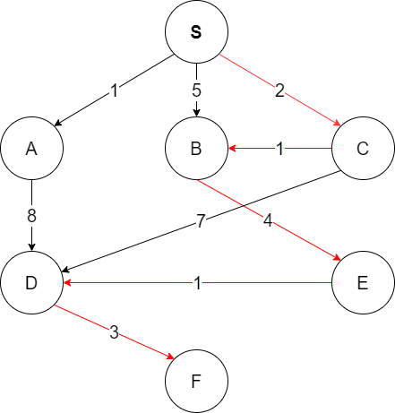

## java-algorithms-implementation

# Búsqueda heurística sin adversarios

1.3. Práctica 2
=================
---

## 1. Instalación de ANT 
Se debe instalar Apache Ant y agregar variables de entorno para ANT.

Dentro del directorio bin de la instalación de Ant se encuentran 
los archivos de arranque en forma de "scripts" para Shell. El comando ant ejecuta Ant sobre los parámetros 
del archivo build.xml.

Para comprobar que está bien instalado ejecutar el siguiente comando: 

~~~
ant -version
~~~

## 2. Ejecución del programa
Se debe ejecutar desde la carpeta java-algorithms-implementation.
Para ejecutar la clase Main.java usar el comando:

~~~
ant run_main
~~~

## 3. Grafo 

En el grafo anterior queremos encontrar el camino óptimo desde S a F. Al ejecutar el programa nos devuelve el siguiente resultado: 

## 4. Preguntas sobre el programa 

**¿Qué variable representa la lista ABIERTA?**

La variable openSet de la clase Astar.java.

**¿Qué variable representa la función g?**

La variable gScore en la clase Astar.java.

**¿Qué variable representa la función f?**

La variable fScore en la clase Astar.java.

**¿Qué método habría que modificar para que la heurística representara la distancia aérea entre vértices?**

El método heuristicCostEstimate en la clase Astar.java. Devuelve 1 y no utiliza un cálculo 
de distancias aéreas.

**¿Realiza este método reevaluación de nudos cuando se encuentra una nueva ruta a un determinado vértice? Justifique la respuesta.**

 Sí realiza reevaluación de los nudos cuando se encuentra una nueva ruta en un vértice concreto. Se puede ver en la clase Astar.java: 
 
~~~
// fScore has changed, re-sort the list
Collections.sort(openSet,comparator);
~~~
Se ordenan los nudos del openSet para que el siguiente nudo a expandir sea el que tenga el menor valor de fScore. El 'comparator'
compara los fScore y devuelve los valores necesarios para la función sort. 

